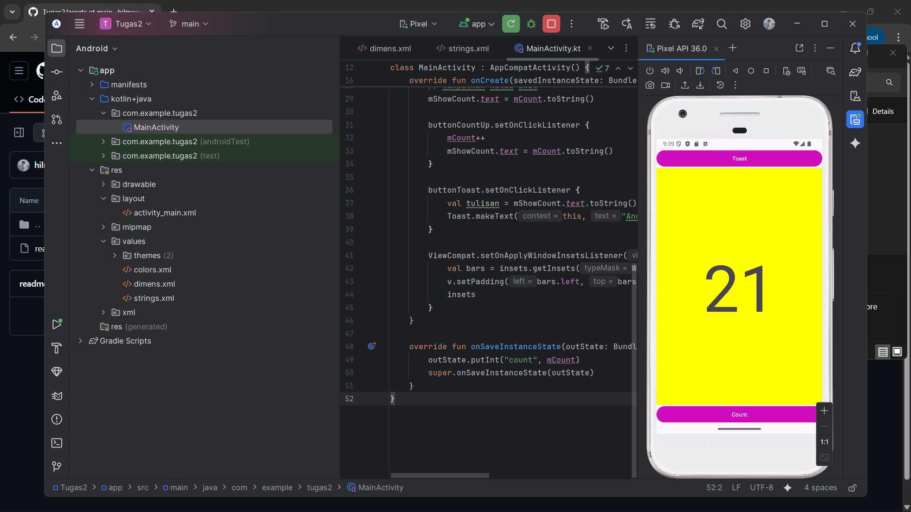
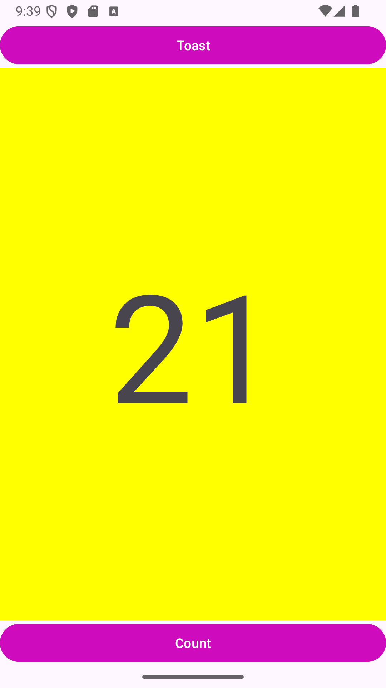

## 👤 Pembuat
**Hilman Maulana** — UIN Sunan Gunung Djati Bandung  
Kelas: **Pengembangan Aplikasi Mobile (D)**  
NIM: **1237050020**

---

## 🖼️ Preview Tugas
  

## 🖼️ Running Aplikasi

---

## Deskripsi Singkat — Tugas 2
Membaca materi dan mengerjakan **Modul Pengerjaan Layout** di Android:

- Mengubah **ConstraintLayout → LinearLayout**  
- Menambahkan komponen **Button**, **TextView**, dan **Toast**  
- Mengatur **padding**, **dimens**, dan **string resources**  
- Menguji interaksi (klik tombol **Count** & **Toast**) di emulator/device  

---

## 🎯 Target Hasil
- Layout rapi dan responsif  
- Nilai counter bertambah saat tombol **Count** ditekan  
- Muncul pesan **Toast** sesuai nilai saat ini  
- Struktur resources (`layout/`, `values/`) tersusun benar  

---

## ▶️ Cara Menjalankan (Singkat)
1. Buka project di **Android Studio** → **Sync Gradle**  
2. Pilih emulator/HP (USB debugging aktif) → **Run ▶**  

---
